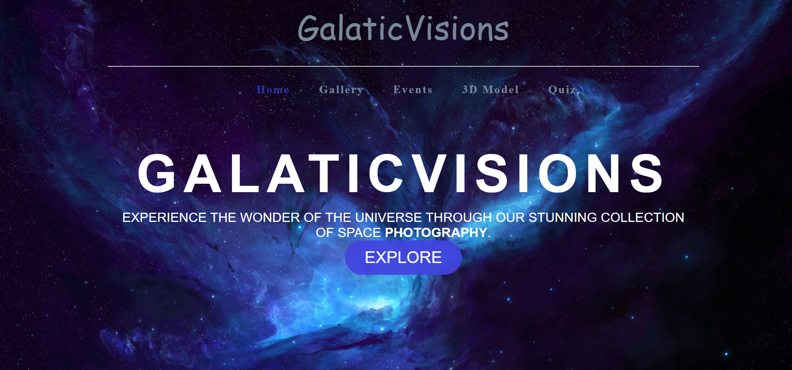
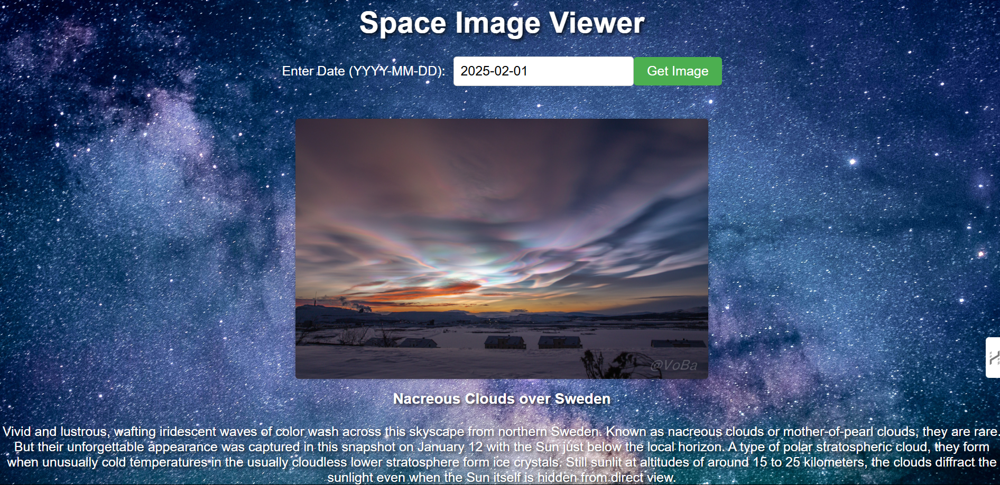
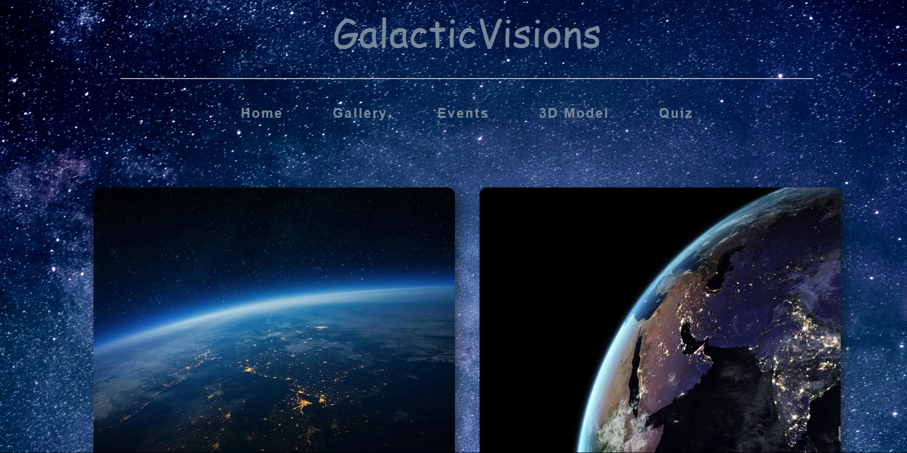

# 3D Planet & Object Viewer

A web-based interactive 3D Planet & Object Viewer that allows users to explore planets and space objects using **WebGL** and **Google Model Viewer**. The project features a search input where users can type the name of a planet or space object, and view a 3D model along with its details like diameter, distance from the sun, and number of moons.

## Features

- View 3D models of planets and space objects in your browser.
- Auto-rotate and camera controls for an interactive experience.
- Detailed information about each planet or space object, including:
  - Name
  - Diameter
  - Distance from the Sun
  - Number of Moons
- Search bar with autocomplete functionality to easily find planets and space objects.
- Responsive design for both desktop and mobile devices.

## Technologies Used

- **HTML**: For structuring the web page.
- **CSS**: For styling the web page and 3D model container.
- **JavaScript**: For interactivity and dynamic content rendering.
- **jQuery**: For implementing the autocomplete search functionality.
- **Google Model Viewer**: For displaying 3D models of planets and space objects.
- **jQuery UI**: For implementing the autocomplete feature in the search bar.

## Sections

### 1. Home Page
The **Home** page serves as the main entry point to explore the universe, offering access to various sections of the site.



### 2. Day to Event
This page displays upcoming events related to space exploration and astronomy, such as rocket launches, space missions, and star-gazing events.



### 3. 3D Model Viewer
The **3D Model Viewer** allows users to view interactive 3D models of planets, moons, and spacecraft, providing an immersive experience.


### 4. Gallery
The **Gallery** showcases stunning images and renderings of planets, galaxies, and space phenomena.



## 🔮 Live Preview

[✨ View the Live](https://galacticvisions.netlify.app/3dmodel) 

## Getting Started

### Prerequisites

To run the project locally, you need to have a modern web browser (e.g., Chrome, Firefox) that supports WebGL and the `<model-viewer>` tag.

### Cloning the Repository

1. Clone the repository to your local machine using Git:

   ```bash
      git clone https://github.com/Vivek7738/Galaticvisions.git
